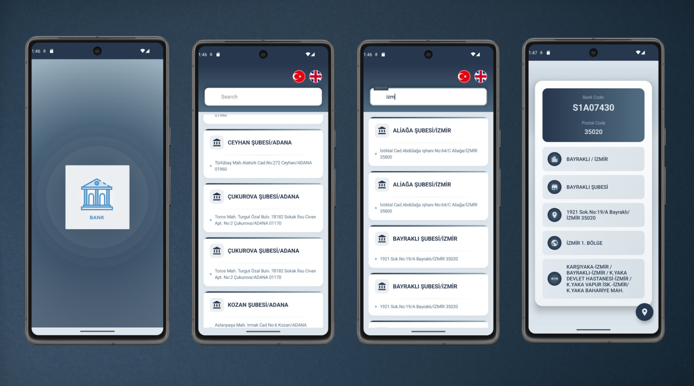

# JetBank 🏦

**JetBank** is a modern Android application that provides comprehensive information about bank branches across Turkey. Built with cutting-edge Android development technologies, it offers users an intuitive way to discover, explore, and navigate to bank locations.



## ✨ Features

- 🏢 **Complete Bank Directory**: Access detailed information about bank branches throughout Turkey
- 🗺️ **Google Maps Integration**: Navigate directly to selected bank locations
- 🌐 **Bilingual Support**: Available in both Turkish and English
- 📱 **Modern UI**: Clean, intuitive interface built with Jetpack Compose
- 🔄 **Real-time Data**: Live bank information fetched from remote API
- 📶 **Network Monitoring**: Intelligent network connectivity handling
- 🎨 **Custom Design System**: Consistent theming with beautiful gradients and animations

## 🛠️ Tech Stack

- **Jetpack Compose** - Modern UI toolkit
- **MVVM + Clean Architecture** - Structured development pattern
- **Dagger Hilt** - Dependency injection
- **Retrofit** - Network operations
- **Coroutines + Flow** - Asynchronous programming
- **Navigation Compose** - App navigation
- **Lottie** - Animations


## 📱 Screens

- 🏠 **Home Screen** - Browse bank branches with search functionality
- 📋 **Detail Screen** - View detailed bank information and navigate to location
- 🚀 **Splash Screen** - Animated app introduction

## 🌐 API Integration

Bank data is sourced from:
```
https://raw.githubusercontent.com/fatiha380/mockjson/main/bankdata
```

## 🔧 Getting Started

1. Clone the repository
2. Open in Android Studio
3. Sync project with Gradle files
4. Run the app

## 📦 Dependencies

**Core**: Jetpack Compose, Material 3, Navigation Compose  
**Architecture**: Dagger Hilt, ViewModel, Lifecycle Components  
**Networking**: Retrofit, Gson  
**Async**: Coroutines, Flow  
**UI**: Lottie, Coil, Material Icons

## 🌍 Localization

Supports Turkish and English based on device settings.

## 🤝 Contributing

Contributions are welcome! Please feel free to submit a Pull Request. For major changes, please open an issue first to discuss what you would like to change.

## 📄 License

This project is licensed under the MIT License - see the [LICENSE](LICENSE) file for details.

## 👨‍💻 Developer

**Altan Koç**
- GitHub: [@altanbkoc](https://github.com/altanbkoc)

---

⭐ **If you found this project helpful, please give it a star!** ⭐
